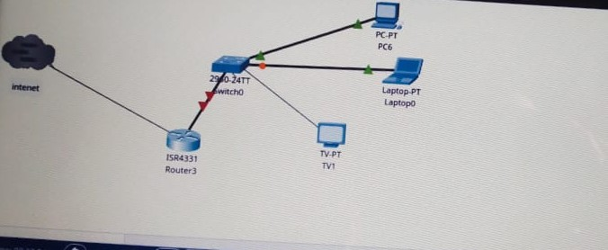

Computer Network Experiments

Experiment 1: Study of Network Devices

📌 Aim:

To study the following network devices in detail:

PC

Server

Repeater

Hub

Switch

Bridge

Router

Gateway

Transmission Medium

🛠 Software Used:

CISCO Packet Tracer

---

🔹 Network Devices Overview

🔹 1. Node

A network node is a connection point in a communications network that can receive, create, store, or send data along distributed network routes.

🔹 2. Repeater

Operates at Physical Layer (Layer 1).

A repeater is an electronic device that receives a signal and retransmits it at a higher power or to the other side of an obstruction to extend the coverage distance.

🔹 3. Hub

Also known as Ethernet hub, active hub, network hub, repeater hub.

A hub connects multiple twisted pair or fiber optic Ethernet devices, making them act as a single network segment.

It works at the Physical Layer (Layer 1) and functions as a multiport repeater.

Hubs participate in collision detection, forwarding a jam signal when a collision occurs.

🔹 4. Switch

A switch is a network device that connects different network segments.

Operates at the Data Link Layer (Layer 2).

Layer 3 switches can also process data at the Network Layer (Layer 3).

🔹 5. Bridge

A bridge connects multiple network segments at the Data Link Layer (Layer 2).

It follows the IEEE 802.1D standard and functions like a switch with fewer ports.

Bridges analyze incoming data packets to determine if they need to be forwarded to another network segment.

---

📝 Result:

Thus, the network components were successfully studied in detail.

📌 This repository contains network simulation image and detailed documentation to enhance understanding of computer networks.

---

